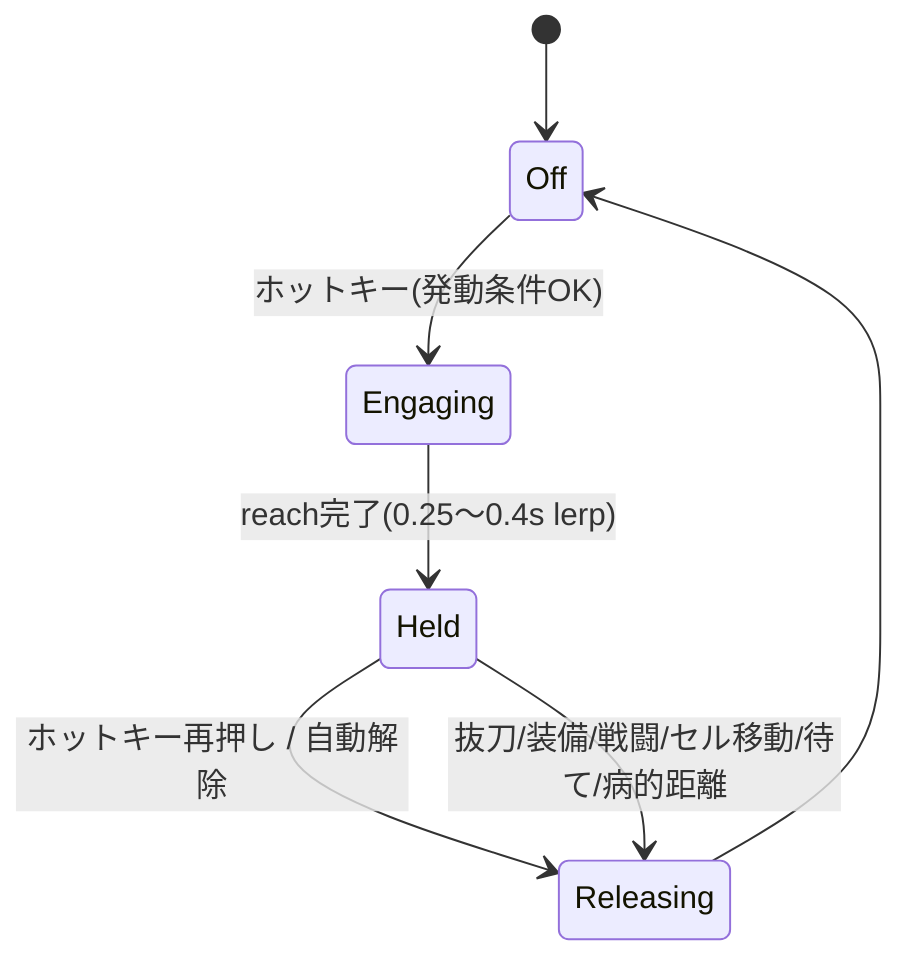

# TETHER — MVP設計サマリ（合意済み）

ICO風「手を引いて走る」をSkyrim SEのフォロワーで再現するmod。狙う質感＝**2体が半独立に動きつつ手で繋がり、張り/緩みで生きて見える**。硬い同期ペアアニメは不採用。**絶対防衛ライン＝段差・旋回で手が剥がれるのは一切許容しない。**

MVPの1本目 = **run（牽引モード）**：プレイヤー主導で、フォロワーが後方から手を引かれてついてくる。

---

## レイヤースタック（MVPの具体機構）

| 層 | 役割 | MVPの実装 |
|---|---|---|
| **L0 基礎移動** | フォロワーの腰を動かす | バニラfollow/**navmesh**（地形ロバスト）。tether中は一時上書きパッケージで制御 |
| **L1 牽引ターゲット** | 立ち位置＝引く目標 | `KeepOffsetFromActor` で **後方＋わずか左**（左手⇔右手が体を横切らない側） |
| **L2 手の接続** | 腕を繋ぐ | **kinematic**。プレイヤー左腕=**aim（剛体的に向ける）**／フォロワー右腕=**2ボーンIK**でプレイヤー左手へ到達。後段フックでボーン直接上書き（IKは自前計算） |
| **L3 テンション** | 張り/緩みの感触 | **タイト既定**。張りの主役は「距離→肘の伸縮（自動）」。バネは薄い化粧＋数cmの遊び。全ツマミMCM可変 |
| **L4 剥がれ防止** | 絶対に外れない | 多層: ①KeepOffsetで届く距離を保つ ②超えかけたら引き戻し強化 ③残差は**腕を数cmだけ弾性伸ばし**て貼り付け ④ハード解除は病的状態のみ（段差・旋回では絶対に切らない） |

### runの「引っ張り」が生まれる仕組み
プレイヤー加速 → フォロワーの体が KeepOffset＋navmesh で少し遅れる（ラグ）→ 2体の距離が伸びる → フォロワー右腕IKの**肘が曲がり→まっすぐ伸びる**＝**視覚的にピンと張る**。navmeshの追いつきは元々ラグがあるので、これだけで生きて見える。届く範囲を超えた一瞬だけ L4 が処理。

---

## 発動と状態（MVP）

- **発動条件**: プレイヤーもフォロワーも **納刀＋左右とも空**。片方でも崩れたら自動解除。
- **発動入力**: **ホットキー（既定 `H`、MCM再割り当て可）でトグル**。ICO風の接近プロンプトUIは最終形で載せるがMVPは後回し（＝簡易発動先行）。
- **対象選択**: TETHER独自の**前方コーン内・最寄り適格フォロワー**（Activate/クロスヘアpickに相乗りしない＝BTPS等と競合しない）。
- **同時1本のみ**（プレイヤー左手＝フォロワー1体）。

---

## 握り（MVP）
- **握り=C（軽い手つなぎ・指は絡めない）**。ただし **MVPはユーザー作業ゼロ**：プラグインが2手を**いい感じに重ねる**だけ、指は**バニラ移動のまま**。run速度・距離なら握って見える。
- オフセットは「小さな重なり定数」を**実機で目視調整**（authoredポーズ由来のWYSIWYGは将来のwalk/デート段で復活）。

---

## 構成物と分担

| 構成物 | 中身 | 誰 |
|---|---|---|
| ① SKSEプラグインDLL（心臓部） | 後段フック/IK/aim/バネ/L4/状態管理/KeepOffset/入力・状態判定 | **Claudeがソース**、コンパイルは手順提示 |
| ② ESP/ESL | tether用クエスト＋参照エイリアス＋一時上書きパッケージ＋"tether中"シグナル＋MCM用クエスト | **ユーザーがSSEEdit/CK**（Claudeが仕様を1つずつ指示） |
| ③ MCM Helper設定JSON | 設定UI | **Claude**（②に依存） |
| ④ OARアニメ | （将来）カスタムロコモ・握り込み | 将来ユーザー |

- ターゲット = **CommonLibSSE-NG**（SE/AE 1ソース）。
- 最小プロトタイプは **DLLだけ**で動く（ESPはMCM/シグナル段から）。

---

## MVPスコープ境界

**IN（MVPで通す）**: run牽引・ホットキー発動・後方左KeepOffset・kinematic IK/aim・タイトなバネ・L4剥がれ防止・納刀両手空ゲート・自動解除・単一フォロワー・三人称前提。

**OUT（将来）**: walk/デートモード（横並び・指まで作り込む握り・WYSIWYGポーズ）／ICO風接近プロンプトUI／カスタムロコモ（女の子っぽい歩き）／抜刀状態での手つなぎ／複数同時／一人称の作り込み／havokの装飾利用。

---

## 実機で詰めるチューニング（設計では固定しない）
KeepOffsetのBackDist/RightDist/追いつき半径、握りの重なり定数、バネの硬さ/減衰/張り立ち上がり、L4の伸び上限とクッション窓、reach lerp時間、対象コーン角/距離、ホットキー。
